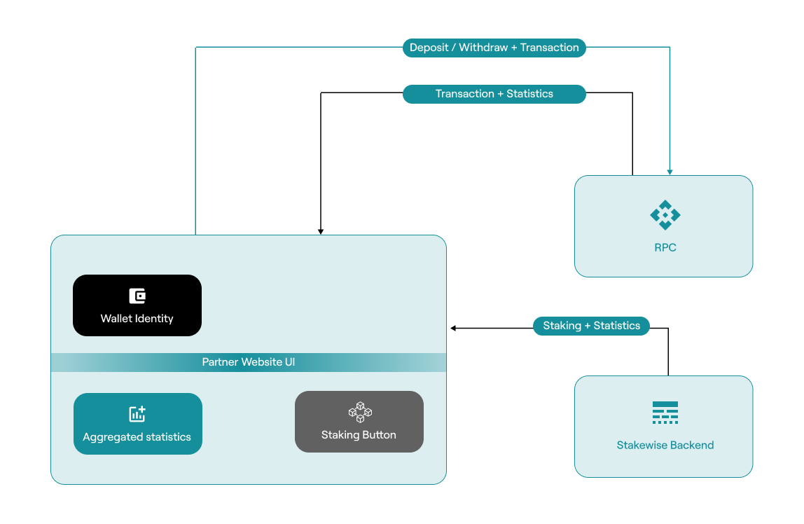

# OPUS Pool SDK

## 🔔 Notice: Migration to Chorus One SDK

The OPUS Pool SDK has been integrated into the [Chorus One SDK](https://chorus-one.gitbook.io/sdk). We recommend all users migrate to the new SDK, which supports multiple networks (Ethereum, Solana, NEAR, and more) and offers enhanced signing options with fireblocks, ledger and local signing.
Visit the [Chorus One SDK Documentation](https://github.com/ChorusOne/chorus-one-sdk) for more details.

**Please note**: The OPUS Pool SDK will no longer receive new updates or releases but will remain available for legacy use.

## Overview

[OPUS Pool SDK](https://www.npmjs.com/package/@chorus-one/opus-pool) provides
a programmatic interface to deliver integration of
non-custodial staking on Ethereum networks. It enables easy integration with pools, including those operated by Chorus One, allowing users to stake any amount of ETH and start earning rewards immediately.

It’s powered by StakewiseV3’s audited and secure smart contracts and leverages Chorus One's proprietary [MEV Research](https://chorus.one/categories/mev) for enhanced returns. Whether you're interested in liquid staking, automated restaking of rewards, or creating a regulated pool for specific users, this guide will walk you through leveraging the OPUS Pool SDK to its full potential.

The SDK interface is implemented as Typescript library `opus-pool`,
which is distributed under Apache 2.0 license.

## Integration Flow

## Demo

Visit [Demo website](https://chorusone.github.io/opus-pool-demo/) to try out the steps you will learn in this guide staking with OPUS Pool SDK.
Please note that [Holesky testnet](https://github.com/eth-clients/holesky) wallet is necessary to actually stake there.

Source code of the demo can be found [on Github](https://github.com/chorusOne/opus-pool-demo)

## HOW TO

Read through the [practical guide](./book/guide/0-prerequisites.md) to understand the key steps, or the [API docs](./book/docs/classes/OpusPool.md)
