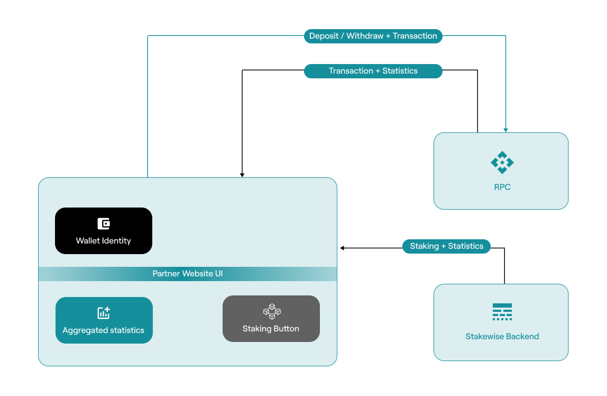

## OPUS Pool SDK

[OPUS Pool SDK](https://www.npmjs.com/package/@chorus-one/opus-pool) provides
a programmatic interface to deliver integration of
non-custodial staking on Ethereum networks.

The SDK interface is implemented as Typescript library `opus-pool`,
which is distributed under Apache 2.0 license.

## Introduction

Welcome to the OPUS Pool SDK documentation. The OPUS Pool, created by Chorus One, offers a non-custodial Ethereum pooling solution that turns ETH staking into a straightforward process. This SDK enables easy integration with pools, including those operated by Chorus One, allowing users to stake any amount of ETH and start earning rewards immediately.

It’s powered by Stakewise V3’s audited and secure smart contracts and leverages Chorus One’s proprietary [MEV Research](https://chorus.one/categories/mev) for enhanced returns. Whether you’re interested in liquid staking, automated restaking of rewards, or creating a regulated pool for specific users, this guide will walk you through leveraging the OPUS Pool SDK to its full potential.

## Integration Flow

## Understanding Key Concepts

📥 What is Staking?

Staking in the blockchain world, particularly in Ethereum, involves locking cryptocurrencies to support network operations and, in return, earning rewards. It’s a key component of the Proof-of-Stake (PoS) model, which Ethereum has adopted. Stakers contribute to network security and efficiency and are compensated with additional tokens proportional to their staked amount.

🏦 Pools: Collective Staking for Enhanced Rewards

A pool is where individual stakers combine their resources. This collective approach benefits those who may not have substantial resources or technical knowledge for individual staking. Pools increase the chances of earning rewards by aggregating the staking power of multiple participants. The OPUS ecosystem offers a non-custodial pooling solution, enabling users to stake their assets while maintaining control and enjoying the benefits of pooled resources.

🏰 Vaults: Customized Staking Pools

Vaults are isolated staking pools offering a trustless, non-custodial process for ETH deposits, reward distribution, and withdrawals. These pools operate independently, using ETH deposits solely to launch validators for that particular Vault, ensuring any rewards or penalties are confined to it. They provide a customized staking experience enabling owners to define their staking fees, opt for a particular mix of operators, employ a unique MEV strategy and other capabilities. Governed entirely by smart contracts, each Vault caters to the specific needs of its depositors, maintaining the integrity and isolation of each staking experience.

🪙 Minting osETH: Creating Liquid Staking Tokens

Minting osETH involves converting staked ETH in Vaults into liquid staking tokens. This process enables stakers to utilize their assets in the DeFi ecosystem without losing staking rewards. By minting osETH, users can maintain liquidity and flexibility while contributing to network security. The amount of osETH that can be minted is determined by the staked ETH value, current exchange rate, and a 90% minting threshold set by the StakeWise DAO. This ensures that osETH remains overcollateralized, providing robust backing and value stability.

🔥 Burning osETH: Redeeming Staked ETH

Burning osETH is destroying osETH tokens to reclaim the underlying staked ETH. When users wish to unstake their ETH, they must return the minted osETH, which is then burned. This reduces the total supply of osETH and unlocks the corresponding staked ETH. During this process, a 5% commission on the rewards accumulated by osETH is automatically deducted, ensuring the integrity of the staking process. This novel commission structure helps maintain osETH’s value and ensures it remains fully backed by staked ETH.

📤 Unstaking: Reclaiming Your ETH

Unstaking allows users to withdraw their staked ETH from a Vault, stopping the accrual of staking rewards and regaining control over their assets. The process begins with the user initiating an unstaking request, which uses available unbonded ETH in the Vault to fulfill it. If there isn’t enough unbonded ETH, a sufficient number of Vault validators will be exited to provide the necessary ETH. This process can take time, so users are placed in an exit queue until the validators are exited. While in the exit queue, users continue to earn staking rewards. Once the exit is complete, users can claim their unstaked ETH at any time.

## Demo

Visit [Demo website](https://chorusone.github.io/opus-pool-demo/) to try out the steps you will learn in this guide staking with OPUS Pool SDK.
Please note that [Holesky testnet](https://github.com/eth-clients/holesky) wallet is necessary to actually stake there.

Source code of the demo can be found [on Github](https://github.com/chorusOne/opus-pool-demo)

## HOW TO

Read through the [practical guide](./guide/0-prerequisites.md) to understand the key steps, or the [API Reference](./docs/classes/OpusPool.md)
