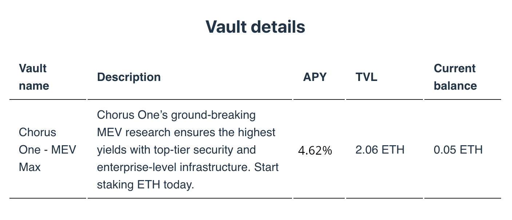

## Table of Contents

-   [Overview](#overview)
-   [Initializing the Pool and Fetching Vault Details](#initializing-the-pool-and-fetching-vault-details)
-   [Displaying Vault Details as a Table](#displaying-vault-details-as-a-table)
-   [Next Steps](#next-steps)

## Overview

In this section, we will explore how to fetch and display vault details using the OPUS Pool SDK.

This process involves initializing the pool, fetching the vault details, and presenting them in a user-friendly format.

## Initializing the Pool and Fetching Vault Details

First, we start by initializing the pool like we did previously. Then, we use the `getVaultDetails` method to fetch details about the vaults. You can refer to the detailed code for this process [here][get-vault-details-usage].

**Here’s a snippet illustrating this process:**

```typescript
const pool = new OpusPool({
    address, // Provided by wagmi
    network, // Networks.Holesky
});

const vault = getDefaultVaults(network)[0];
// Alternatively, you can define vaults yourself:
// const vault = '0x...';

// Note: The getVaultDetails method accepts an array of vault addresses.
const vaultDetails = await pool.getVaultDetails([vault]);

console.log(vaultDetails[0]);
// {
//   address: "0x95d0db03d59658e1af0d977ecfe142f178930ac5",
//   name: "Chorus One Test Wallet",
//   description: "Test wallet for Chorus",
//   logoUrl: "https://storage.stakewise.io/dxepxhzxsrqs.png",
//   tvl: 5600841037682025178745n,
//   apy: "3.98146836137682602839366230181093629",
//   balance: 1999487039539970377023n
// }
```

The `VaultDetails` object returned by `getVaultDetails` contains the following parameters:

-   **`address` (Hex)**: The hexadecimal address of the Vault.
-   **`name` (string)**: A human-readable identifier for the Vault.
-   **`description` (string)**: A description of the Vault.
-   **`logoUrl` (string)**: The URL of the Vault’s logo for UI display.
-   **`tvl` (bigint)**: The total value of assets locked in the Vault, expressed in wei.
-   **`apy` (string)**: The average yield percentage derived from historical data.
-   **`balance` (bigint)**: The current balance of the connected address in the Vault.

## Displaying Vault Details as a Table

Now, let’s display these vault details in a table format in the UI.

The following code snippet, which you can find [here][get-vault-details-ui], demonstrates how to achieve this:

```typescript
import { formatEther } from 'viem';
import { VaultDetails } from '@chorus-one/opus-pool';

const Vault = ({ vaultDetails }: { vaultDetails: VaultDetails[] }) => {
   return (
     <table>
        <thead>
           <tr>
             <th>Vault name</th>
             <th>Description</th>
             <th>APY</th>
             <th>TVL</th>
             <th>Current balance</th>
           </tr>
        </thead>
        <tbody>
           {vaultDetails.map((vault: VaultDetails) => (
             <tr key={vault.name}>
                <td>{vault.name}</td>
                <td>{vault.description}</td>
                <td>{vault.apy * 100} %</td>
                <td>{Number(formatEther(vault.tvl)).toLocaleString()} ETH</td>
                <td>{Number(formatEther(vault.balance)).toLocaleString()} ETH</td>
             </tr>
           ))}
        </tbody>
     </table>
   );
};
```

Once rendered, the vault details will be displayed in an informative table on the screen, showcasing key information such as vault name, APY, and balances in a user-friendly format:



## Next Steps

In this section, we learned how to fetch and display details of a vault using the OPUS Pool SDK. To continue exploring the functionality of the SDK, you can proceed to the next section: [Staking Functionality][stake].

[get-vault-details-usage]: https://github.com/ChorusOne/opus-pool-demo/blob/main/src/hooks/useVaultDetails.ts#L43
[get-vault-details-ui]: https://github.com/ChorusOne/opus-pool-demo/blob/main/src/components/Vault.tsx#L31
[stake]: ./3-stake.md
