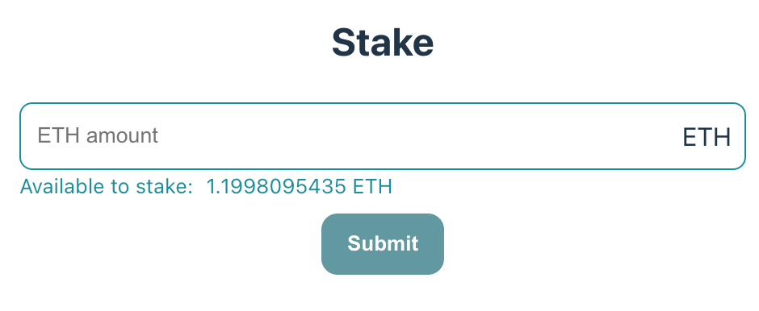

# 3. Staking Functionality

-   [3. Staking Functionality](#3-staking-functionality)
    -   [The Form Component](#the-form-component)
    -   [Writing the Staking Transaction Function](#writing-the-staking-transaction-function)
    -   [Next Steps](#next-steps)

To incorporate staking functionality into your application, we'll begin by creating a simple form. This form will consist of an input field for the amount to be staked and a button to submit the transaction. Below is a basic implementation of this form in React:

## The Form Component

```typescript
import React, { useState } from 'react';
import { useAccount, useBalance } from 'wagmi';

export const FormComponent = ({ onSubmit }) => {
   const { address } = useAccount();
   const { data: balance } = useBalance({
     address,
   });
   const [inputValue, setInputValue] = useState('');

   return (
     <div>
        <form onSubmit={(e) => {
           e.preventDefault();
           onSubmit(inputValue);
           setInputValue('');
        }}>
           <input
             type="text"
             placeholder="ETH amount"
             onChange={(e) => setInputValue(e.target.value)}
             value={inputValue}
           />
           <span>ETH</span>
           <div>Available: {balance?.formatted} ETH</div>
           <button type="submit">Submit</button>
        </form>
     </div>
   );
};
```

This form component makes use of the `useAccount` and `useBalance` hooks from `wagmi` to manage user account details and balance information. The `onSubmit` prop is a function that handles the actual staking process, which you can define in your application logic.

For a more comprehensive implementation, which includes error handling, loading states, and styling, refer to our [extended version][stake-ui] available in the codebase.

This simple yet effective form provides the basic functionality needed to integrate staking into your Ethereum-based application



## Writing the Staking Transaction Function

Now, we will focus on the core functionality of our application: submitting a staking transaction. The complete code for this can be found [here][stake-usage]. Here is a representative snippet of the function:

```typescript
const stake = async ({
    userAddress, // Comes from wagmi
    walletClient, // Comes from wagmi
    network, // Networks.Holesky
    vault, // Vault address (can be provided by getDefaultVaults(...))
    amount, // Amount of Eth to deposit, denominated in gwei
}: {
    userAddress: Hex;
    walletClient: ReturnType<typeof useWalletClient>['data'];
    network: Networks;
    vault: Hex;
    amount: bigint;
}): Promise<Hex> => {
    const pool = new OpusPool({ network, address: userAddress });

    const stakeRes = await pool.buildStakeTransaction({
        vault,
        amount,
    });
    const { transaction, gasEstimation, maxPriorityFeePerGas, maxFeePerGas } = stakeRes;

    await walletClient.sendTransaction({
        account: userAddress,
        to: vault,
        data: transaction,
        value: amount,
        type: 'eip1559',
        gas: gasEstimation,
        maxPriorityFeePerGas,
        maxFeePerGas,
    });
};
```

> ℹ️ This function utilizes the Ethereum Improvement Proposal 1559 (EIP-1559) transaction type. With EIP-1559, users specify two types of fees:
>
> -   **`maxFeePerGas`**: The maximum fee per gas the user is willing to pay. This includes the base fee and the priority fee.
> -   **`maxPriorityFeePerGas`**: Also known as the tip, this incentivizes miners to prioritize the transaction.
>
> The actual fee paid is determined by the network, based on the current demand for block space and the priority of the transaction. Fortunately, the Opus pool SDK provides gas estimation, simplifying the process.

Each parameter in the `TransactionDataReturnType` object returned by `buildStakeTransaction` serves a specific purpose:

-   **`type`**: Indicates the transaction type, either "Stake" or "Unstake".
    It always will be "Stake" in this case
-   **`transaction`**: A contract hashed method call with encoded arguments (the transformation of the method call into this encoded and hashed form is handled by the `encodeFunctionData` method from the `viem` library).
-   **`gasEstimation`**: The estimated gas required for the transaction.
-   **`amount`**: The amount of ETH being staked, if applicable.
-   **`maxPriorityFeePerGas`**: The maximum priority fee per gas (in wei).
-   **`maxFeePerGas`**: The total fee per gas (in wei), inclusive of the `maxPriorityFeePerGas`.

## Next Steps

In this section, we focused on the core functionality of our application, which is submitting a staking transaction.This function utilizes the Ethereum Improvement Proposal 1559 (EIP-1559) transaction type and the Opus pool SDK for gas estimation. To continue exploring the functionality of our application, you can proceed to the next section: [minting functionality][mint].

Continue to [minting os token functionality][mint]

[stake-ui]: https://github.com/ChorusOne/opus-pool-demo/blob/master/src/components/FormComponent.tsx#L8
[stake-usage]: https://github.com/ChorusOne/opus-pool-demo/blob/master/src/hooks/useStakeMutation.ts#L40
[mint]: ./4-mint-os-token.md
