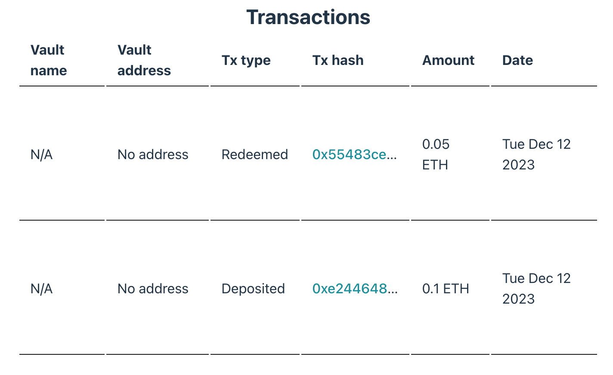

## Table of Contents

-   [Overview](#overview)
-   [Initializing the Pool and Fetching Transaction History](#initializing-the-pool-and-fetching-transaction-history)
-   [Displaying Transaction History](#displaying-transaction-history)
-   [Next Steps](#next-steps)

## Overview

Tracking the transaction history of your vaults is important for accountability and understanding users staking, unstaking, minting and other activities. With the Opus SDK, you can fetch detailed transaction history, which includes up to 1000 transactions associated with a given vault.

This chapter will guide you through fetching and displaying this transaction history.

## Initializing the Pool and Fetching Transaction History

To start, we need to initialize the `OpusPool` in the same manner as we did previously. Then, we’ll use the `getTransactionsHistory` method provided by the SDK to retrieve the transaction history. The relevant code and more detailed explanations can be found [here][get-transactions-history-usage].

**Here’s how you can write the code snippet for this process:**

```typescript
const pool = new OpusPool({
    address,
    network,
});

// Note: Passing multiple vaults to the method will return transactions for all of them.
const transactionHistory = await pool.getTransactionsHistory([vault]);

console.log(transactionHistory);
// [
//   {
//     "vault": "0x95d0db03d59658e1af0d977ecfe142f178930ac5",
//     "when": 2024-05-24T10:06:36.000Z,
//     "type": "Deposited",
//     "amount": 100000000000000000n,
//     "hash": "0x8f642080e5cab110eb9b12c6380076216bc69920eb32f000b5db6f8b2a6a5559-344"
//   }
// ]
```

The `getTransactionsHistory` method returns an array of `VaultTransaction` objects. Each of these objects contains details about individual transactions. Here’s a breakdown of the parameters in a `VaultTransaction` object:

-   **`vault` (Hex)**: The address of the vault that the user interacted with.
-   **`when` (Date)**: The date and time of the transaction.
-   **`type` (VaultActionType)**: The type of transaction, which can be `Deposit`, `Redeem`, etc.
-   **`amount` (bigint)**: The amount of Ethereum transacted, denominated in wei.
-   **`hash` (string)**: The unique hash identifier of the transaction.



The `VaultActionType` enum includes the following types of transactions:
**`Redeemed`**, **`Deposited`**, **`VaultCreated`**, **`OsTokenMinted`**, **`OsTokenBurned`**, **`OsTokenRedeemed`**, **`OsTokenLiquidated`**, **`ExitedAssetsClaimed`**, **`Migrated`**



## Displaying Transaction History

After fetching the transaction history, we will display it in a structured table format. The complete code for this implementation can be found [here][get-transactions-history-ui].

**Here’s the code snippet for the transaction history table:**

```typescript
import { formatEther } from 'viem';
import { VaultTransaction } from 'opus-pool';

const Transactions = ({ transactions }: { transactions: VaultTransaction[] }) => {
  return (
    <table>
      <thead>
        <tr>
          <th>Vault Name</th>
          <th>Vault Address</th>
          <th>Transaction Type</th>
          <th>Transaction Hash</th>
          <th>Amount</th>
          <th>Date</th>
        </tr>
      </thead>
      <tbody>
        {transactions.map((transaction, index) => {
          const { vault } = transaction;
          const shortAddress = vault?.address
            ? `${vault.slice(0, 6)}...${vault.slice(-4)}`
            : 'No Address';
          const type = transaction.type ?? 'No Type';
          const date = transaction.when
            ? transaction.when.toDateString()
            : 'No Date';
          const hash = transaction.hash
            ? transaction.hash.split('-')[0]
            : '-';

          return (
            <tr key={index}>
              <td>{vault.name}</td>
              <td>{shortAddress}</td>
              <td>{type}</td>
              <td>
                <a href={`https://holesky.etherscan.io/tx/${hash}`}>{hash}</a>
              </td>
              <td>{formatEther(transaction.amount, 'wei')} ETH</td>
              <td>{date}</td>
            </tr>
          );
        })}
      </tbody>
    </table>
  );
};
```

The `Transactions` component function takes an array of `VaultTransaction` objects and renders them in a table. Each transaction’s details, including the vault name, address, transaction type, hash, amount, and date, are neatly displayed. Transaction hashes are linked to Etherscan for easy tracking.

**Once rendered, the transaction history will be displayed in an informative table on the screen:**



## Next Steps

In this chapter, we learned how to fetch transaction history using the `getTransactionsHistory` method and displayed it in a structured table format.

Next, we will fetch the vault rewards history and draw its chart. Please proceed to the [Rewards History][rewards-history] chapter to continue.

[get-transactions-history-usage]: https://github.com/ChorusOne/opus-pool-demo/blob/master/src/hooks/useTransactions.ts#L22
[get-transactions-history-ui]: https://github.com/ChorusOne/opus-pool-demo/blob/main/src/components/Transactions.tsx#L52
[rewards-history]: ./8-rewards-history.md
