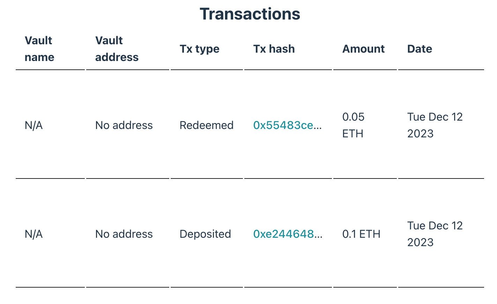

# 5. Transactions History

-   [5. Transactions History](#5-transactions-history)
    -   [Initializing the Pool and Fetching Transaction History](#initializing-the-pool-and-fetching-transaction-history)
    -   [Displaying Transaction History](#displaying-transaction-history)
    -   [Next Steps](#next-steps)

In this chapter, we'll explore how to fetch and display the transaction history of vaults using the Opus SDK. The SDK provides the `getTransactionsHistory` method, which returns up to 1000 stake or unstake transactions of the current user associated with a given array of vaults.

## Initializing the Pool and Fetching Transaction History

To start, we need to initialize the `OpusPool` in the same manner as we did previously. Then, we'll use the `getTransactionsHistory` method provided by the SDK to retrieve the transaction history. The relevant code and more detailed explanations can be found [here][get-transactions-history-usage].

Here’s how you can write the code snippet for this process:

```typescript
const pool = new OpusPool({
    address,
    network,
});

const vaults = getDefaultVaults(network);
// Alternatively, you can define your own set of vaults:
// vaults = ['0x...', '0x...'];
const transactionHistory = await pool.getTransactionsHistory(vaults);
// Note: Passing multiple vaults to the method will return transactions for all of them.
```

The `getTransactionsHistory` method returns an array of `VaultTransaction` objects. Each of these objects contains details about individual transactions. Here's a breakdown of the parameters in a `VaultTransaction` object:

-   `vault` (Hex): The address of vault that the user interacted with.
-   `when` (Date): The date and time of the transaction.
-   `type` (VaultActionType): The type of transaction, can be `Deposit`, `Redeem` etc
-   `amount` (bigint): The amount of Ethereum transacted, denominated in Gwei.
-   `hash` (string): The unique hash identifier of the transaction.

## Displaying Transaction History

Having fetched the transaction history, we will now display this data in a structured table format. The complete code for this implementation can be found [here][get-transactions-history-ui].

Here's the code snippet for the transaction history table:

```typescript
import { formatEther } from "viem";
import { VaultTransaction } from "opus-pool";

const Transactions = ({ transactions }: { transactions: VaultTransaction[] }) => {
  return (
    <table>
      <thead>
        <tr>
          <th>Vault Name</th>
          <th>Vault Address</th>
          <th>Transaction Type</th>
          <th>Transaction Hash</th>
          <th>Amount</th>
          <th>Date</th>
        </tr>
      </thead>
      <tbody>
        {transactions.map((transaction, index) => {
          const { vault } = transaction;
          const shortAddress = vault?.address
            ? `${vault.slice(0, 6)}...${vault.slice(-4)}`
            : "No Address";
          const type = transaction.type ?? "No Type";
          const date = transaction.when
            ? transaction.when.toDateString()
            : "No Date";
          const hash = transaction.hash
            ? transaction.hash.split("-")[0]
            : "-";

          return (
            <tr key={index}>
              <td>{vault.name}</td>
              <td>{shortAddress}</td>
              <td>{type}</td>
              <td>
                <a href={`https://etherscan.io/tx/${hash}`}>{hash}</a>
              </td>
              <td>{formatEther(transaction.amount, "wei")} ETH</td>
              <td>{date}</td>
            </tr>
          );
        })}
      </tbody>
    </table>
  );
};
```

In this snippet, we import `formatEther` from the "viem" library and `VaultTransaction` from the "opus-pool". The `TransactionsComponent` function takes an array of `VaultTransaction` objects and renders them in a table. Each transaction’s details, including the vault name, address, transaction type, hash, amount, and date, are neatly displayed. Transaction hashes are linked to Etherscan for easy tracking.

Once rendered, the transaction history will be displayed in an informative table on the screen.



## Next Steps

In this section, we learned how to fetch transaction history using the `getTransactionsHistory` method. We also displayed the transaction history in a structured table format. Next, we will move on to fetching vault rewards history and drawing a chart for it. To continue, please proceed to the [Rewards History][rewards-history] section.

[Continue to Rewards History][rewards-history]

[get-transactions-history-usage]: https://github.com/ChorusOne/opus-pool-demo/blob/master/src/hooks/useTransactions.ts#L21
[get-transactions-history-ui]: https://github.com/ChorusOne/opus-pool-demo/blob/master/src/components/Interactions.tsx#L52
[rewards-history]: ./8-rewards-history.md
