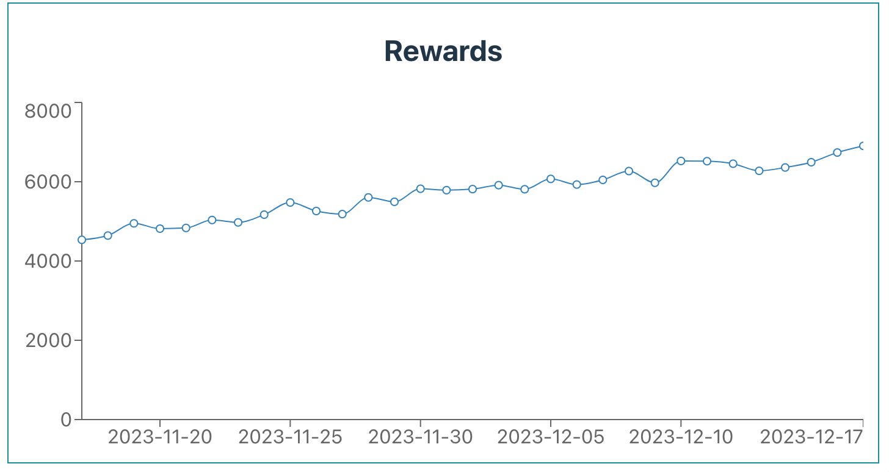

# 6. Rewards History

In this chapter, we'll focus on fetching and visualizing the rewards history using the Opus SDK. The SDK offers a `getRewardsHistory` method, which retrieves the history of rewards earned from specific vaults.

## Initializing the Pool and Fetching Rewards History

As with our previous tasks, we begin by initializing the `OpusPool`. Then, we'll use the `getRewardsHistory` method to gather the rewards history. You can find the relevant code [here][get-rewards-history-usage].

Below is a sample code snippet for fetching rewards history:

```typescript
const pool = new OpusPool({
    address,
    network,
});

const vaults = getDefaultVaults(network); // Alternatively, you can use your own vaults

// Targeting only one vault
const vault = vaults[0];

// Setting the date range: from 1 month ago to today
const from = new Date();
from.setMonth(from.getMonth() - 1);
const to = new Date();

const rewardsHistory = await pool.getRewardsHistory({
    from,
    to,
    vault,
});
```

The `getRewardsHistory` method requires an object with the following parameters:

-   `from` (Date): The starting date for the rewards retrieval query.
-   `to` (Date): The end date for the rewards retrieval query.
-   `vault` (Hex): The address of the vault for which to retrieve rewards.

The method returns an array of `RewardsDataPoint` objects, each containing:

-   `when` (Date): The reference date for the rewards received.
-   `amount` (bigint): The amount of rewards received, denoted in Gwei.
-   `vault` (Hex): The address of the vault that generated the rewards.

## Transforming Data for Chart Visualization

To visualize this data effectively, we'll transform it into a format suitable for our chart library:

```typescript
const chartData = rewardsHistory.map((point) => {
    return {
        date: point.when.toDateString(),
        amount: Number(formatGwei(point.amount)),
    };
});
```

In this transformation, we’re converting each data point into an object containing a readable date string and the amount of rewards formatted from Gwei. This format is specific for chart library we are using - Recharts.

## Visualizing Rewards Data with a Chart

To provide a more visual representation of the rewards, we will utilize a chart. For this tutorial, we have chosen to use [Recharts][recharts], a composable charting library built on React components. However, feel free to use any other charting library that suits your needs. The complete code for this implementation, along with additional details, can be found [here][get-rewards-history-ui].

Here’s the code snippet for creating a line chart with our rewards data:

```typescript
import { LineChart, Line, XAxis, YAxis } from 'recharts';

type ChartDataPoint = {
    amount: number;
    date: string;
};

const RewardsChart = ({ data }: { data: ChartDataPoint[] }) => {
    return (
        <LineChart width={700} height={300} data={data}>
            <XAxis dataKey="date" />
            <YAxis />
            <Line type="monotone" dataKey="amount" />
        </LineChart>
    );
};
```

In this snippet, we import the necessary components from Recharts and define the `RewardsChart` component. This component takes an array of `ChartDataPoint` objects and renders them in a LineChart. The `XAxis` and `YAxis` components provide axis context for the chart, while the `Line` component plots the transaction amounts over time.

## Chart Representation on the Screen

Once rendered, the line chart provides a clear view of reward trends over time.



# Wrapping Up

Throughout this tutorial, we have explored the integration of the OPUS Pool SDK for Ethereum staking. We covered the initial setup process, fetching and displaying vault details, and practical staking and unstaking functionality. We have also learned how to fetch and present transaction history, along with visualizing rewards history using charts. This guide aimed to provide a clear foundation for incorporating Ethereum staking into web applications. We appreciate your presence throughout this journey, and we hope this guide has empowered you to utilize the OPUS Pool SDK effectively in your projects.

For further information and detailed API documentation, we recommend visiting the [API Docs][api]

[get-rewards-history-usage]: https://github.com/ChorusOne/opus-pool-demo/blob/master/src/hooks/useRewards.ts#L27
[recharts]: https://recharts.org
[get-rewards-history-ui]: https://github.com/ChorusOne/opus-pool-demo/blob/master/src/components/Rewards.tsx#L41
[api]: ../docs/classes/OpusPool.md
